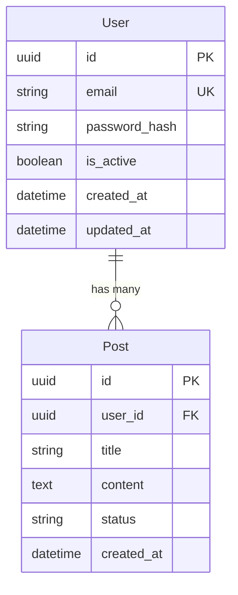
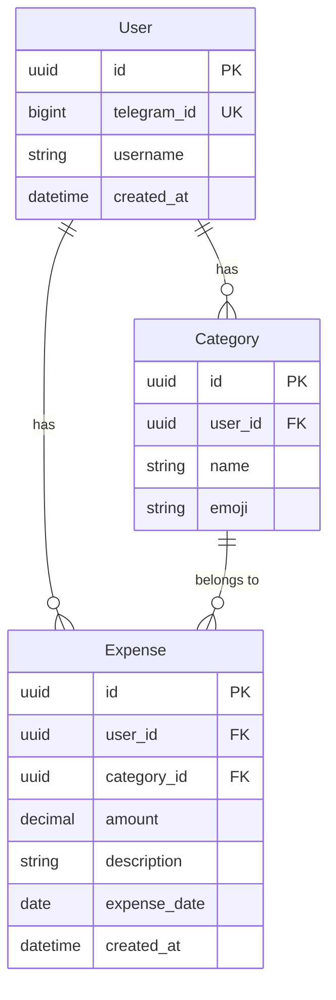

# Vibe Coding Workflow — Процесс разработки с AI

> Главный файл методологии. Описывает пошаговый процесс создания проекта с помощью AI-ассистента.
> Подходит для небольших проектов: Telegram-боты, одностраничные сайты, MVP.

---

## Что такое вайбкодинг

Вайбкодинг — это подход к разработке, где ты задаёшь направление и контролируешь процесс, а AI пишет код. Ты — архитектор и ревьюер, AI — исполнитель. Эффективность зависит от того, насколько хорошо ты ставишь задачи и контролируешь качество.

**Главный принцип:** Планируй → Исследуй → Реализуй по шагам → Проверяй каждый шаг.

---

## Этап 0: Исследование

> Прежде чем писать код — разберись в предметной области.

### Что делать

1. **Изучить аналоги** — посмотри похожие проекты, их фичи, архитектуру
2. **Выбрать стек** — на основе требований и опыта
3. **Найти best practices** — как другие решают похожие задачи
4. **Определить ограничения** — что можно, что нельзя, лимиты API

### Инструменты для исследования

| Инструмент | Когда использовать |
|------------|-------------------|
| **Perplexity AI** | Быстрые факты, сравнения технологий, "как сделать X" |
| **GitHub Search** | Найти примеры кода, open-source аналоги |
| **Официальная документация** | API, библиотеки, фреймворки |
| **Stack Overflow** | Решения конкретных проблем |
| **Cursor Web Search** | Из самого AI — поиск актуальной информации |

### Product Brief

Перед началом сформулируй:

```markdown
## Product Brief

**Что:** [Одно предложение — что делает продукт]
**Кто:** [Целевая аудитория]
**Фичи:**
1. [Основная фича]
2. [Вторая фича]
3. [Третья фича]

**Стек:** [Перечислить технологии]
**Ограничения:** [Лимиты, дедлайн, ресурсы]
```

### AI-промпт для исследования

```
Я хочу создать [описание проекта].
Целевая аудитория: [кто].
Ключевые фичи: [список].

Помоги мне:
1. Выбрать оптимальный стек технологий
2. Найти потенциальные проблемы и ограничения
3. Предложить архитектуру проекта
4. Показать аналоги для референса
```

---

## Этап 1: Планирование базы данных

> БД — фундамент. Начни с неё, не с кода.

### Процесс

1. Определи сущности (таблицы)
2. Определи связи между ними (1:1, 1:N, N:M)
3. Определи поля, типы, constraints
4. Добавь миксины (UUID, timestamps, soft delete)
5. Нарисуй ER-диаграмму

### ER-диаграмма (Mermaid)



### AI-промпт для БД

```
Спланируй схему базы данных для [описание проекта].

Требования:
- PostgreSQL
- UUID v4 как первичные ключи
- Автоматические created_at / updated_at
- Soft delete (is_deleted, deleted_at)
- Описать таблицы, поля, типы, constraints, индексы
- Показать ER-диаграмму в mermaid

Сущности: [список основных сущностей]
```

### Чек-лист БД

- [ ] Все таблицы с UUID PK
- [ ] created_at / updated_at на всех таблицах
- [ ] Foreign keys с ondelete (CASCADE / SET NULL)
- [ ] Индексы на полях поиска и фильтрации
- [ ] CheckConstraint для enum-полей
- [ ] Уникальные ограничения где нужно

---

## Этап 2: Проектирование API

> На основе БД опиши контракт API — что принимаем, что отдаём.

### Процесс

1. Для каждой сущности определи CRUD-эндпоинты
2. Разделяй public (без auth) и protected (с auth) эндпоинты
3. Определи request/response формат
4. Спланируй пагинацию, фильтрацию, сортировку

### Формат описания API

```markdown
### Users API

| Метод | URL | Auth | Описание |
|-------|-----|------|----------|
| POST | /api/v1/auth/login | Нет | Логин |
| GET | /api/v1/users | Да | Список пользователей |
| GET | /api/v1/users/{id} | Да | Пользователь по ID |
| POST | /api/v1/users | Да (admin) | Создание |
| PATCH | /api/v1/users/{id} | Да (admin) | Обновление |
| DELETE | /api/v1/users/{id} | Да (admin) | Удаление |

#### POST /api/v1/users — Request
{
  "email": "user@example.com",
  "first_name": "Иван",
  "role": "editor"
}

#### POST /api/v1/users — Response (201)
{
  "id": "uuid",
  "email": "user@example.com",
  "first_name": "Иван",
  "role": "editor",
  "created_at": "2025-01-01T00:00:00Z"
}
```

### AI-промпт для API

```
На основе этой схемы БД:
[вставить схему]

Опиши REST API эндпоинты:
- Для каждой сущности: CRUD (GET list, GET by id, POST, PATCH, DELETE)
- Формат: метод, URL, auth, request body, response body
- Пагинация для list-эндпоинтов (page, page_size)
- Версионирование: /api/v1/
- Ошибки в формате RFC 7807
```

---

## Этап 3: Бэкенд реализация

> Код по модулям: models → migrations → schemas → service → router.

### Порядок реализации

```
1. models.py    — SQLAlchemy модели (из этапа 1)
2. alembic      — Миграция (alembic revision --autogenerate)
3. schemas.py   — Pydantic схемы Create/Update/Response (из этапа 2)
4. service.py   — Бизнес-логика CRUD
5. router.py    — FastAPI эндпоинты
6. main.py      — Регистрация роутера
```

### AI-промпт для бэкенда

```
Реализуй модуль [name] для FastAPI по паттерну:

Используй rules из BACKEND_RULES.md.

Структура:
- models.py: SQLAlchemy модель с миксинами (UUID, Timestamp, SoftDelete)
- schemas.py: Pydantic v2 — Create, Update, Response
- service.py: CRUD в сервисном слое
- router.py: FastAPI роутер с depends

Модель: [описание полей]
Эндпоинты: [список из этапа 2]
```

### Правила для AI

- Подключай `BACKEND_RULES.md` как контекст
- Один модуль за раз — не проси "сделай весь бэкенд"
- Проверь миграцию перед следующим модулем
- Тестируй каждый эндпоинт через curl / Swagger

---

## Этап 4: Фронтенд реализация

> На основе готового API строй интерфейс.

### Порядок реализации

```
1. Настрой проект (Next.js + Tailwind + TypeScript)
2. Создай API-клиент (Axios instance, interceptors)
3. Реализуй auth (логин, токены, protected routes)
4. По фичам: API хук (React Query) → UI компонент → страница
```

### AI-промпт для фронтенда

```
Создай страницу [name] с использованием:

Используй rules из FRONTEND_RULES.md.

API эндпоинты:
- GET /api/v1/[resource] — список (пагинация)
- POST /api/v1/[resource] — создание
- PATCH /api/v1/[resource]/{id} — обновление
- DELETE /api/v1/[resource]/{id} — удаление

Требования:
- React Query для данных
- Таблица с пагинацией
- Модалка создания/редактирования (React Hook Form + Zod)
- Loading и error states
- Tailwind для стилей
```

### Правила для AI

- Подключай `FRONTEND_RULES.md` как контекст
- Сначала API-хуки, потом UI
- Проверяй в браузере каждый компонент
- Не забывай про мобильную адаптивность

---

## Этап 5: Деплой

> Собираем всё вместе и выкатываем.

### Порядок

```
1. Dockerfile для бэкенда
2. docker-compose.yml (dev) — проверить локально
3. docker-compose.prod.yml (prod)
4. Nginx конфиги
5. SSL (init-ssl.sh)
6. Deploy-скрипт
7. Backup-скрипт
8. Cron: SSL renew + DB backup
```

### AI-промпт для деплоя

```
Настрой деплой проекта:

Используй rules из DEPLOY_RULES.md.

Что нужно:
- Dockerfile (multi-stage build)
- docker-compose.yml для dev (hot-reload, порты открыты)
- docker-compose.prod.yml для prod (nginx, SSL, порты закрыты)
- Nginx конфиг для api.domain.com и admin.domain.com
- init-ssl.sh для Let's Encrypt
- deploy.sh для zero-downtime деплоя
- Makefile с основными командами
```

---

## Правила работы с AI

### Золотые правила

1. **Контекст — король.** Всегда давай AI rules-файлы, существующий код, схему БД. Чем больше контекста — тем лучше результат.

2. **Одна задача за раз.** Не проси "сделай мне весь бэкенд". Проси "создай модуль users с CRUD". Маленькие задачи → лучший результат.

3. **Проверяй каждый шаг.** Прогнал миграцию — проверь. Создал эндпоинт — протестируй. Не накапливай непроверенный код.

4. **Исследуй перед тем как кодить.** Перед новой задачей — погугли, почитай доки, спроси Perplexity. AI пишет код лучше, если ты понимаешь что хочешь.

5. **Plan → Agent.** Сложные задачи начинай в Plan mode (обсуждение), потом переключайся в Agent mode (реализация).

### Типичные ошибки

| Ошибка | Как правильно |
|--------|--------------|
| "Сделай мне проект целиком" | Разбей на этапы, начни с БД |
| Нет rules/контекста | Подключи файлы правил к проекту |
| Не проверяешь результат | Тестируй после каждого шага |
| Слишком большие промпты | Одна фича — один промпт |
| Не используешь исследование | Perplexity/Google перед кодингом |

### Режимы работы в Cursor

| Режим | Когда использовать |
|-------|-------------------|
| **Plan** | Обсуждение архитектуры, выбор подхода, планирование |
| **Agent** | Написание кода, создание файлов, запуск команд |
| **Ask** | Вопросы по коду, ревью, объяснения |

---

## Пример: Telegram-бот

### Product Brief

```markdown
**Что:** Telegram-бот для учёта расходов
**Кто:** Пользователи, которые хотят трекать траты
**Фичи:**
1. Добавить расход (/add 500 еда)
2. Статистика за период (/stats, /stats month)
3. Категории расходов
4. Экспорт в CSV

**Стек:** Python 3.11, aiogram 3, PostgreSQL, Docker
```

### Шаг 1: БД



### Шаг 2: Структура проекта

```
expense-bot/
├── bot/
│   ├── handlers/        # Обработчики команд
│   │   ├── start.py
│   │   ├── add.py
│   │   └── stats.py
│   ├── services/        # Бизнес-логика
│   │   ├── expense.py
│   │   └── stats.py
│   ├── models/          # SQLAlchemy модели
│   │   └── models.py
│   ├── keyboards/       # Inline/reply клавиатуры
│   │   └── main.py
│   └── config.py        # Настройки
├── alembic/
├── Dockerfile
├── docker-compose.yml
├── .env
└── requirements.txt
```

### Шаг 3: Деплой

```yaml
# docker-compose.yml
services:
  bot:
    build: .
    env_file: .env
    depends_on:
      postgres:
        condition: service_healthy
    restart: unless-stopped

  postgres:
    image: postgres:16-alpine
    environment:
      POSTGRES_USER: bot_user
      POSTGRES_PASSWORD: bot_pass
      POSTGRES_DB: bot_db
    volumes:
      - postgres_data:/var/lib/postgresql/data
    healthcheck:
      test: ["CMD-SHELL", "pg_isready -U bot_user"]
      interval: 5s
      retries: 5
```

Webhook через nginx:

```nginx
location /webhook/bot {
    proxy_pass http://bot:8080/webhook;
    proxy_set_header Host $host;
    proxy_set_header X-Real-IP $remote_addr;
}
```

### AI-промпты по шагам

```
# Шаг 1
Спланируй схему БД для Telegram-бота учёта расходов.
Таблицы: users, categories, expenses.
PostgreSQL, UUID PK, timestamps.

# Шаг 2
Создай модели SQLAlchemy для [схема из шага 1].
Используй async, миксины UUID + Timestamp.

# Шаг 3
Создай хендлеры для aiogram 3:
- /start — регистрация пользователя
- /add <сумма> <категория> — добавить расход
- /stats — статистика за текущий месяц

# Шаг 4
Настрой Docker + docker-compose для бота.
PostgreSQL, healthcheck, .env, webhook через nginx.
```

---

## Пример: Одностраничник (лендинг)

### Product Brief

```markdown
**Что:** Лендинг для SaaS-продукта
**Кто:** Потенциальные клиенты
**Фичи:**
1. Hero-секция с CTA
2. Фичи продукта (3-4 карточки)
3. Отзывы / социальное доказательство
4. Форма обратной связи
5. Footer с контактами

**Стек:** Next.js 15, TailwindCSS v4, TypeScript
**Деплой:** Static export → Nginx / Vercel
```

### Структура

```
landing/
├── src/
│   ├── app/
│   │   ├── layout.tsx
│   │   └── page.tsx
│   ├── components/
│   │   ├── Hero.tsx
│   │   ├── Features.tsx
│   │   ├── Testimonials.tsx
│   │   ├── ContactForm.tsx
│   │   └── Footer.tsx
│   └── lib/
│       └── cn.ts
├── public/
│   └── images/
├── tailwind.config.ts
├── Dockerfile
├── docker-compose.yml
└── nginx.conf
```

### AI-промпты по шагам

```
# Шаг 1
Создай Next.js 15 проект с TailwindCSS v4 и TypeScript.
Настрой структуру для лендинга.

# Шаг 2
Создай Hero-компонент:
- Заголовок, подзаголовок, CTA-кнопка
- Градиентный фон
- Адаптивный (mobile-first)
- Tailwind, красивый современный дизайн

# Шаг 3
Создай секцию Features: 3 карточки с иконками, заголовком, описанием.
Grid layout, анимация при появлении.

# Шаг 4
Создай форму обратной связи:
- Имя, email, сообщение
- React Hook Form + Zod валидация
- Отправка на API endpoint (или email)
- Success/error states

# Шаг 5
Настрой деплой: static export, Dockerfile, nginx.conf.
Или: деплой на Vercel.
```

### Деплой лендинга

**Вариант A: Nginx (свой сервер)**

```bash
# Сборка
npm run build
# → out/ — статические файлы

# nginx.conf
server {
    listen 80;
    server_name www.domain.com;
    root /var/www/landing;
    index index.html;
    location / {
        try_files $uri $uri.html $uri/ /index.html;
    }
}
```

**Вариант B: Vercel (zero-config)**

```bash
npm i -g vercel
vercel --prod
```

---

## Итоговый workflow (шпаргалка)

```
┌──────────────────────────────────────────────────────────────┐
│                    VIBE CODING WORKFLOW                       │
├──────────────────────────────────────────────────────────────┤
│                                                              │
│  0. ИССЛЕДОВАНИЕ                                             │
│     Perplexity → аналоги → стек → product brief              │
│                        ↓                                     │
│  1. БАЗА ДАННЫХ                                              │
│     Сущности → связи → поля → ER-диаграмма                   │
│                        ↓                                     │
│  2. API-КОНТРАКТ                                             │
│     Эндпоинты → методы → request/response                    │
│                        ↓                                     │
│  3. БЭКЕНД                                                   │
│     models → migration → schemas → service → router          │
│     + BACKEND_RULES.md                                       │
│                        ↓                                     │
│  4. ФРОНТЕНД                                                 │
│     API client → hooks → components → pages                  │
│     + FRONTEND_RULES.md                                      │
│                        ↓                                     │
│  5. ДЕПЛОЙ                                                   │
│     Docker → Nginx → SSL → scripts                           │
│     + DEPLOY_RULES.md                                        │
│                                                              │
│  ПРАВИЛА:                                                    │
│  ✓ Контекст (rules-файлы) всегда подключены                  │
│  ✓ Одна задача за раз                                        │
│  ✓ Проверка после каждого шага                               │
│  ✓ Исследование перед кодингом                               │
│  ✓ Plan mode → Agent mode                                    │
│                                                              │
└──────────────────────────────────────────────────────────────┘
```
